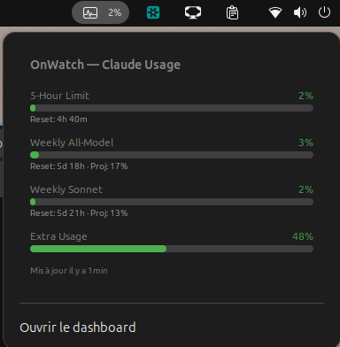

# OnWatch GNOME Extension

GNOME Shell extension to monitor Claude Code usage from the top bar, powered by [onWatch](https://github.com/onllm-dev/onwatch).




## Features

- Displays current quota utilization in the top bar (e.g. `12%`)
- Icon color changes based on status: green (healthy), orange (elevated), red (critical)
- Click to expand a popup with all quotas: 5-Hour, Weekly All-Model, Weekly Sonnet, Extra Usage
- Each quota shows a progress bar, reset countdown, and projected utilization
- Optional OpenRouter API credit balance (remaining $, with used/total) and a 30-day daily-spend histogram when an `OPENROUTER_API_KEY` is configured
- "Open dashboard" button to launch the full onWatch web UI
- Polls the onWatch API every 60 seconds
- Reads credentials automatically from `~/.onwatch/.env`

## Prerequisites

- GNOME Shell 45+
- [onWatch](https://github.com/onllm-dev/onwatch) running on `localhost:9211`

## OpenRouter credit balance (optional)

To also show your remaining OpenRouter API credit, add a provisioning/management
key to `~/.onwatch/.env`:

```
OPENROUTER_API_KEY=sk-or-...
```

The extension then:

- calls `GET https://openrouter.ai/api/v1/credits` and shows the remaining
  balance (`total_credits − total_usage`), and
- calls `GET https://openrouter.ai/api/v1/activity` and draws a histogram of
  daily spend over the last 30 days.

Both require a **provisioning/management key** (not a plain inference key). If
the key is absent or lacks permission, the OpenRouter rows are simply hidden.
(Anthropic has no equivalent "remaining balance" endpoint, so it is not shown.)

## Install

```bash
git clone https://github.com/nmolins/onwatch-gnome-menubar.git
cd onwatch-gnome-menubar
bash install.sh
```

Then log out and log back in (Wayland), and enable the extension:

```bash
gnome-extensions enable onwatch@onllm.dev
```

## Uninstall

```bash
gnome-extensions disable onwatch@onllm.dev
rm -rf ~/.local/share/gnome-shell/extensions/onwatch@onllm.dev
```
